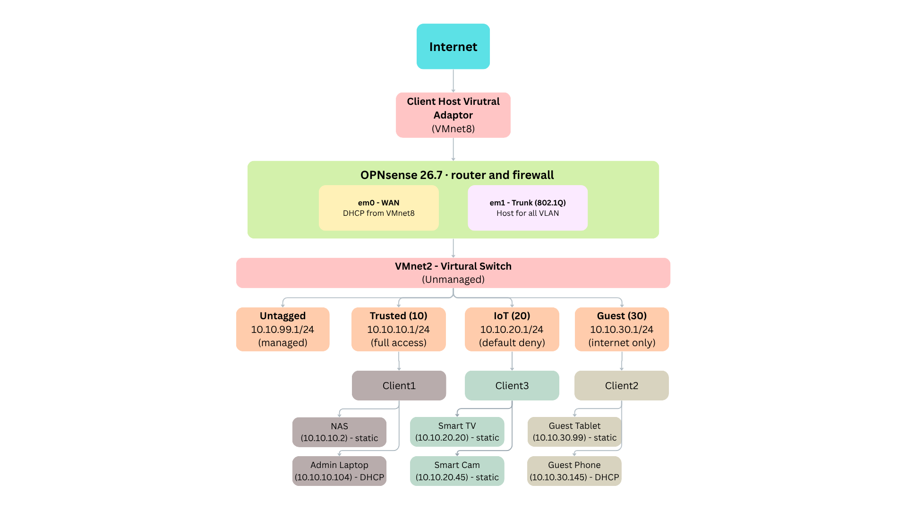

# Virtualized VLAN 
## Summary
The goal of this project is to understand how 802.1Q VLAN tagging works under the hood and how to apply firewall policy for each VLAN, using only VMware.

## Service Used
This project used 5 virtual machines:
1. OPNsense - used as router and firewall. 
	1. Two NICs: `em0` on VMware NAT for internet uplink, `em1` on VMnet2 as an 802.1Q trunk carrying all VLANs.
2. Client1 (Alpine) - Trusted on VLAN 10: `10.10.10.0/24`.
	1. Has full access to other VLANs and the internet.
3. Client2 (Alpine) - IoT on VLAN 20: `10.10.20.0/24`. 
	1. Has default-deny with no rules, then internet-only.
4. Client3 (Alpine) -  Guest on VLAN 30: `10.10.30.0/24`. I
	1. Only has internet access. Blocked from all private networks.
5. Windows 11 - To visit OPNsense admin portal

## Diagram:

This diagram shows the full topology — how all five VMs tie together into one routed network, laid out the way a small home network would actually be segmented.

Read it top to bottom:

- **VMnet8** is VMware's NAT network (`192.168.48.0/24`), not the real home LAN. Traffic out is translated twice: 
	- Once by OPNsense, again by VMware, thus the lab never touches the physical network.
- **OPNsense** is the only router. 
	- `em0` takes a DHCP lease from VMnet8 for the uplink
	- `em1` is an 802.1Q trunk with no address of its own, carrying every VLAN at once. Anything crossing between VLANs must come up the trunk and take a firewall decision on the way.
- **VMnet2** is an unmanaged switch with no VLAN awareness. As in, it forwards tagged frames through untouched. 
	- All the tagging happens in the endpoints' kernels 
		- `vlan0.10/20/30` on OPNsense
		- `eth0.10/20/30` on the clients

| Segment               | Tag | Gateway         | Policy                                   |
| --------------------- | --- | --------------- | ---------------------------------------- |
| Untagged (management) | —   | `10.10.99.1/24` | Admin portal only                        |
| Trusted               | 10  | `10.10.10.1/24` | Full access — all VLANs and the internet |
| IoT                   | 20  | `10.10.20.1/24` | Default-deny, then internet-only         |
| Guest                 | 30  | `10.10.30.1/24` | Internet only, blocked from all RFC1918  |
- Management stays untagged on purpose: if tagging breaks, `10.10.99.1` is still reachable and the firewall can be fixed from a browser.

## Learning Outcomes

- **Rule evaluation is directional:** Trusted → Guest passes while Guest → Trusted drops, for the same two hosts. The rule is evaluated on the interface the traffic *enters*, not on the pair of endpoints.
- **Default-deny means literally nothing:** IoT with no rules could not reach its own gateway nor the internet.
- **The switch does none of the work:** VMnet2 has no VLAN awareness at all, so the separation is created entirely by the sub-interfaces on OPNsense and the clients.
- **Network+ concepts became concrete:** Topics "learned" for CompTIA Network+ & Security+; how 802.1Q tagging behaves on the wire, subnetting and masks, per-VLAN DHCP scopes, and firewall rule order, troubleshooting methodology 

## Full Build Log

Step-by-step commands, every OPNsense screen, and the full test output:

- [[VM VLAN/VM VLAN setup.md|Build log]] — step-by-step setup and what was run in order

<!-- MODIFIED 2026-09-20
     Changed the network topology embed under the Diagram section from an
     Obsidian wikilink (![[network_diagram.png]]) to a standard Markdown link
     pointing at Image/network_diagram.png, so the diagram renders both in
     Obsidian and on GitHub, where wikilinks do not display and the bare
     filename would not resolve to the Image subfolder.
-->
